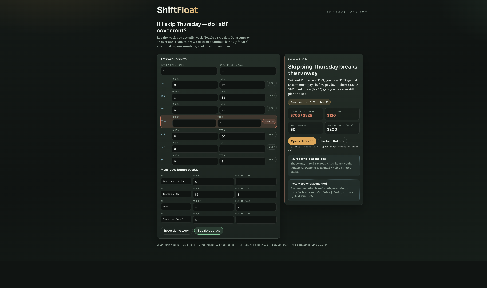
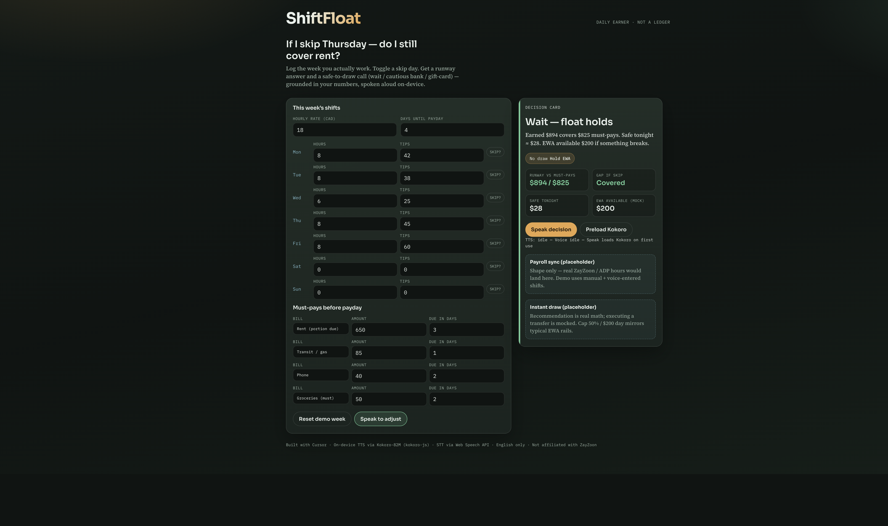
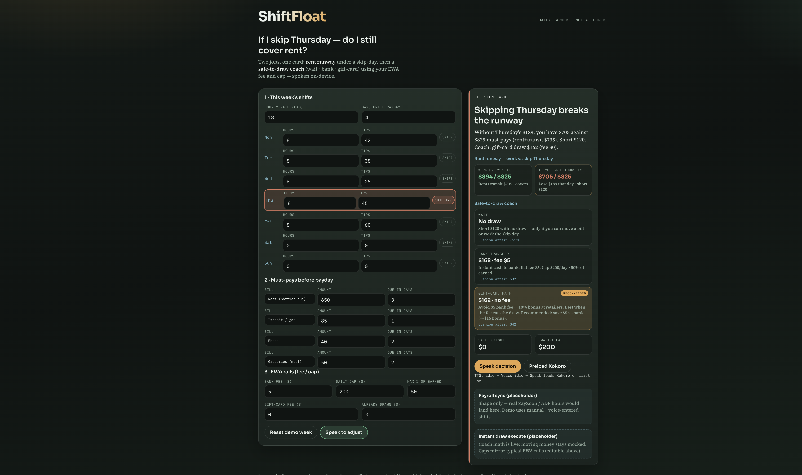

# ShiftFloat

Payday is Friday. Rent hits Wednesday. You’re staring at Thursday’s shift wondering if you can take it off for a sick kid — and whether tapping earned wages tonight helps or just burns a fee.

**ShiftFloat** answers that. Not with another money-in / money-out ledger — with a side-by-side **rent runway** (work every shift vs skip a day) and a **safe-to-draw coach** that scores wait · bank · gift-card against your EWA fee and cap, spoken on-device.

Built with **[Cursor](https://cursor.com)** as the agentic coding harness.

## Live demo

| Surface | URL |
|---------|-----|
| Local | `npm run dev` → http://localhost:5173 |
| Production | _pending `vercel deploy --prod` (approve when ready)_ |

## How it was built

Cursor end-to-end: decision engine, voice I/O, judge-facing README. On-device **Kokoro-82M** TTS (`kokoro-js`) + **Web Speech** STT (English). Payroll sync and real transfers are shaped as placeholders.

## Summary for reviewers

| Criterion | How this project addresses it |
|-----------|-------------------------------|
| **Everyday pain (daily earner)** | “If I skip Thursday, do I still cover rent + transit?” — then whether to draw EWA |
| **Beyond money in / out** | Decision card + skip-day runway, not envelopes or category pie charts |
| **Cursor fit** | Readable mechanism in `src/lib/engine.ts`; voice loop in `src/lib/voice*.ts` |
| **Working demo** | Seeded QSR week; toggle Skip on Thursday; Speak decision |
| **Quality** | Pure decision function; browser TTS fallback if Kokoro cold-start fails |

## What it does

1. Load the seeded week (hours, tips, must-pays before payday).
2. Toggle **Skip?** on a day — compare **work-all vs skip** rent runway (rent+transit called out).
3. Read the **safe-to-draw coach**: three scored paths (wait / bank / gift-card); tweak EWA fee & cap live.
4. **Speak to adjust** (mic) or edit fields; **Speak decision** plays Kokoro (or browser TTS).

## Judge checklist

1. Open the app (local or live URL).
2. Confirm **work vs skip** runway: skip Thursday → short; rent+transit called out.
3. Confirm **safe-to-draw coach** scores Wait / Bank / Gift-card with one Recommended (gift-card on demo seed).
4. Clear Thursday skip — card flips to keep-working / float-holds; skip lane still shows the gap.
5. Tweak **Bank fee** or **Daily cap** — coach paths recalculate.
6. Click **Speak decision**; skim `src/lib/engine.ts`.

## Architecture

```
shifts + bills + skip day
        ↓
   engine.decide()  →  decision card (UI)
        ↓
   Kokoro / speechSynthesis  →  spoken recommendation
```

Stack: Vite · React · TypeScript · kokoro-js (Kokoro-82M ONNX) · Web Speech API.

## Verify locally

```bash
npm install
npm run dev
```

Optional: `npm run build && npm run preview`.

No API keys. First **Speak decision** may download Kokoro weights from Hugging Face into the browser cache.

## Screenshots

| | |
|--|--|
| Skip Thursday → broken runway + coach |  |
| Clear skip → float holds |  |
| Work-vs-skip runway + Wait/Bank/Gift-card coach |  |
